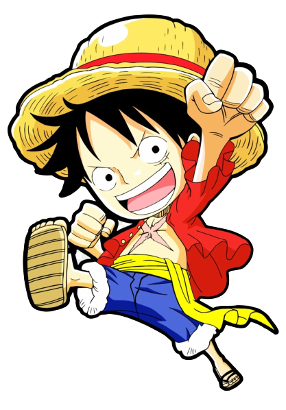

<h1 align = "center">Mini Game One Piece :joystick:</h1>

 Ajude Monkey D luffy e sua tripulação

<h2>:closed_book: Sobre</h2> 
<pre>Este Projeto consiste em um Mini Game construido utilizando a biblioteca <strong>P5.js</strong>, para reforçar alguns conhecimentos 
de Lógica de Programação especificamente utilizando a Linguagem de Programação JavaScript.</pre>
<pre>Alguns dos conhecimentos que puderam ser vistos neste projeto foram: 
✓ Plano Cartesiano
✓ Colisão 💥 com Objetos
✓ Random - gerando objeto em posições aleatórias.
✓ Propriedade : 🖱️ mouseIsPressed
✓ functions: keyPressed ( ) , reset( )
✓incremento ++ , decremento --</pre>
<h2>:hammer_and_pick:Ferramentas</h2>

P5.js
interest
<pre>Em resumo <strong>p5.js</strong> é uma biblioteca JavaScript para codificação criativa, com foco em tornar a codificação acessível e inclusiva
é gratuito e de código aberto. O <strong>Pinterest</strong> é uma rede social de compartilhamento de fotos. Assemelha-se a um quadro de 
inspirações, onde os usuários podem compartilhar e gerenciar imagens temáticas,</strong></pre>
<pre> Durante a construção do Projeto a biblioteca P5.js foi utilizada em seu desenvolvimento é o pinterest foi usado
como fonte de imagens para os personagens, e imagens de fundo.</pre>
<h2>:dart:Objetivo do Jogo</h2>

A aplicação e divida em dois Jogos

:heavy_check_mark:O Objetivo do 1 º Jogo e encontrar o Capitão Monkey D Luffy 
O jogador se movimenta utilizando as setas do teclado :arrow_up::arrow_down::arrow_right::arrow_left: 
:heavy_check_mark:O do 2º Jogo é comer o maxímo de <strong>akuma no mi</strong> (fruta que dá poder), caso o jogador deixe escapar alguma fruta sua quantidade de vidas diminui se a quantidade de vidas chegar a 0 o jogador perde. 
<h2>Telas do Projeto</h2>

  
<h2>:video_game:Execução</h2>
Para executar o projeto voce pode Acessar este link: 
https://editor.p5js.org/carolmosilva34/full/xMZHZFsI2
